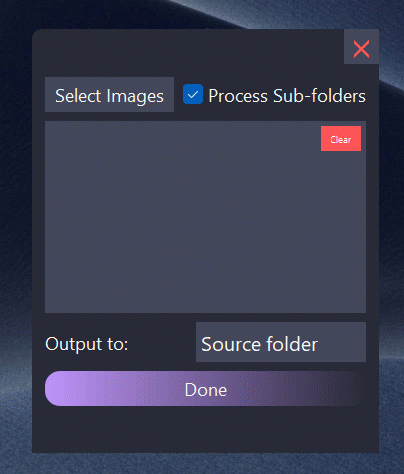

# MiniPixel (gui for mozjpeg)

Auto convert and compress PNG, PSD, TIFF, JPG files into JPG with MOZJPEG compression. 

- Drag and drop
- Multithreading
- Auto compression based on SSIIM, DSSIM and PSNR quality metrics

# Dependencies
```bash
pip install PyQt5 Pillow mozjpeg-lossless-optimization opencv-python numpy psd-tools
```

# To run:
1. Install Python 3,
2. Setup venv
3. Run 

```bash
python3 main.py
```